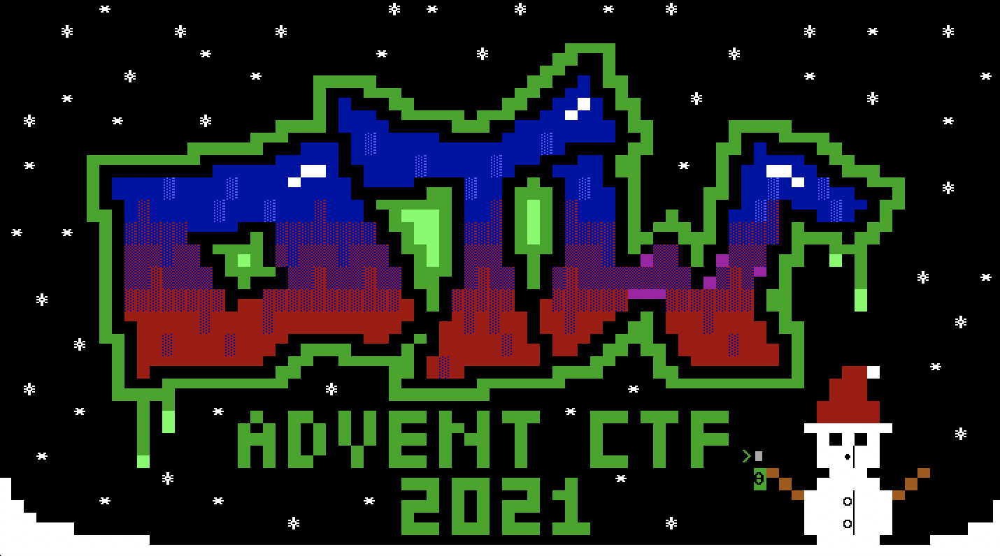
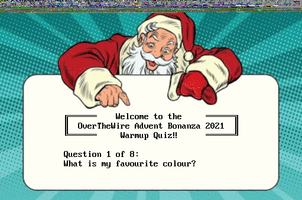
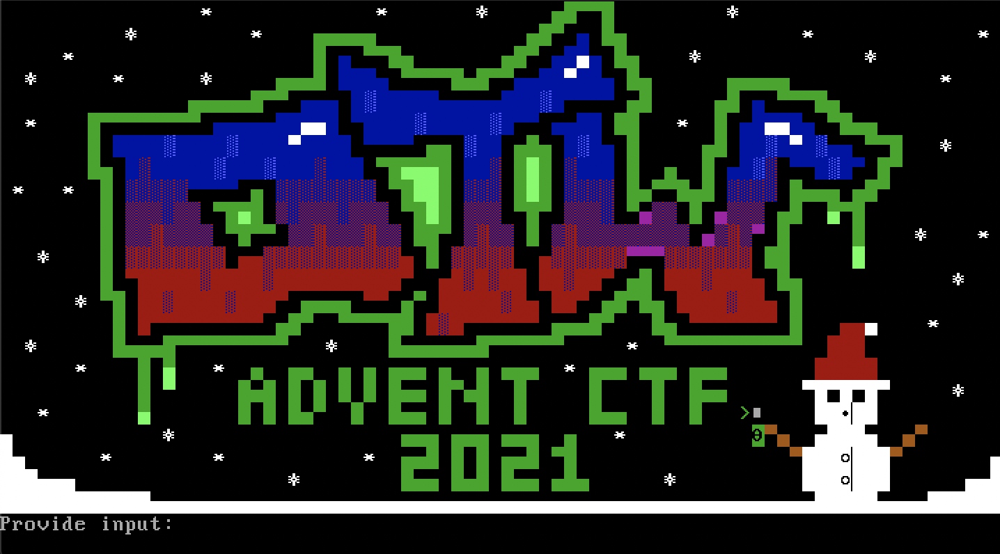
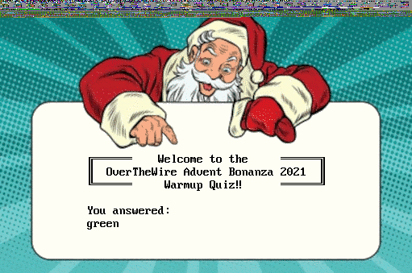
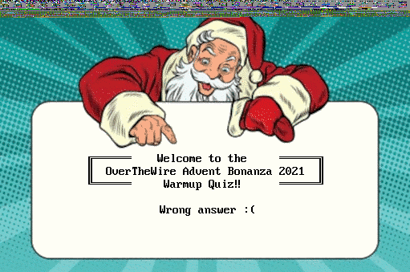
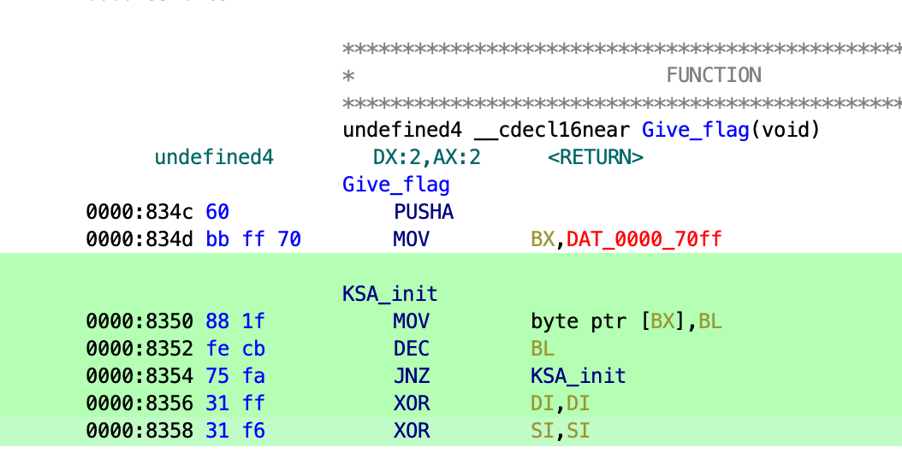
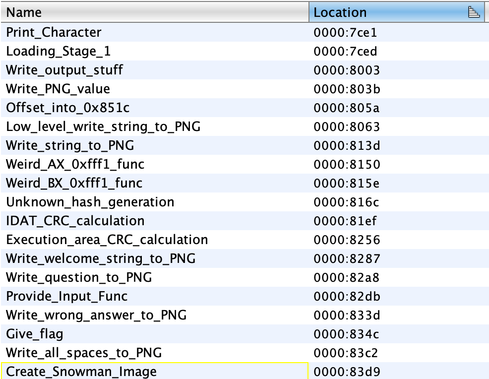

# Credits

This was an extremely fun challenge! Thank you [Retr0id](https://twitter.com/David3141593) for putting this challenge together.

# Table of contents
1. [Starting off](#starting-off)
2. [Running the code](#running-the-code)
3. [Answering questions](#answering-questions)
4. [Static analysis](#static-analysis)
5. [Emulation](#emulation)
    1. [QEMU](#qemu)
    2. [Unicorn](#unicorn)
    3. [Unicorn (continued)](#unicorn-continued)
6. [Bruteforcing rockyou](#bruteforcing-rockyou)

## Starting off

Right off the bat, we're presenting with an [image](images/initial.png) that welcomes us to the event!

There's nothing about this image that appears suspect (aside from the pixels at the top), so we start off with a simple `strings` invocation.

```bash
# strings images/initial.png | head -n 5
IHDR
PLTE
i2KU
Booting Stage0...
Loaded Stage1...
```

Cool, sounds like we should check this out in QEMU.

## Running the code

```bash
# qemu-system-i386 images/initial.png
WARNING: Image format was not specified for 'initial.png' and probing guessed raw.
         Automatically detecting the format is dangerous for raw images, write operations on block 0 will be restricted.
         Specify the 'raw' format explicitly to remove the restrictions.
```

Wow, looks like it worked.

Looking at our emulator, we see the following.



We can hit a key and get a message that our output has been updated.

If we open the image again, we'll see that it has changed and we're prompted to answer a question:
- What is my favourite colour?



This question is equivalent to a string that we saw earlier when running `strings`.

```bash
# strings images/initial.png | grep colour
        What is my favourite colour?
```

## Answering questions

We see that we have a question to answer, but how do we answer it? Running once more in QEMU, we get a new prompt -- "Provide input:"



If we provide an answer (say: "green") and open the resulting images, we'll see a new image, this time with answer we provided!



Finally, if we run the image again in QEMU, we'll see the result of our answer to the question. In our case, we answered incorrectly.



Based on the our usage of `strings`, we can pretty confidently guess what questions we'll be asked, e.g.:

```bash
# strings initial.png | grep -A 9 "Provide input:" | tail -n 9
        What is my favourite colour?
        Who is my favourite reindeer?
        VGhlIGFuc3dlciBpcyBGUk9HUw==
        Jung vf guvf pvcure pnyyrq?
        What is 123
?
        Which cipher encrypted the flag?
        What's my favourite 7-digit prime?
        What's my password? (Hint: rockyou)
```

With a bit of guess and check, we can figure out the first few answer. They are:
1. Red
2. Rudolph
3. FROGS
4. ROT13
5. 30258 (there are some non-ascii characters that didn't get displayed above, but this is a math problem)

The last three questions are the problematic ones. We'll need to disassemble the binary in order to get a better understanding of what's happening.

## Static analysis

Let's pull open Ghidra to try and figure out what's going on.
Importantly, since this PNG is a bootable image running on x86, we'll be in Real Mode where operations that are taking place will be 16 bit.

We can select the "Real Mode" variant and adjust our memory block to 0x7c00 to get us started. Check out [this](https://jarijaas.github.io/posts/disobey-2020/) excellent post for more information.

There's a good bit going on right when we jump into the code, but at a high level:
- We're being asked questions (which are changing)
- We're responding to these questions
- Our answers to these questions are being validated
- All the while, the PNG is being rewritten to display the corresponding images

After digging in Ghidra for a while, we find a few things:
- There's code to handle a lot of the bootloader intricacies (e.g. loading blocks from disk)
  - Eg. we can see the various stages being loaded
- There appear to be some CRC calculations which are being used to determine if input is correct
  - The correct CRCs are hardcoded in the binary (starting at 0x7c4e), so no strings or similar are floating around to use as answers
  - Changing these CRCs wouldn't be useful because...
- Each question helps us get a part of the key which is used to decrypt the flag

Following the logic in the binary, we eventually get to the code that gives us the flag.
There's a lot going on, but importantly, this section (in green) sticks out.



What we're seeing here is the [RC4 Key-Scheduling Algorithm (KSA)](https://en.wikipedia.org/wiki/RC4#Key-scheduling_algorithm_(KSA)) in action.
From Wikipedia, this looks like:

```
for i from 0 to 255
    S[i] := i
endfor
j := 0
for i from 0 to 255
    j := (j + S[i] + key[i mod keylength]) mod 256
    swap values of S[i] and S[j]
endfor
```

The snippet above does the first three lines, which leads to RC4 being a good candidate for our unanswered question 6.
Trying "RC4" yields a successful result.
This leaves us with the final two questions that look rather daunting given they both appear to require bruteforcing.

Further static analysis continues to reveal that the overall logic of this CRC algorithm is rather involved and isn't something that'll be easily ported to code for calculation.

All functions can be reversed to get the following pseudo-functions.



## Emulation

There is probably a world where we could try and figure out the logic of this binary a bit better, but I didn't have the time to do so.

Instead, I turned towards how best to bruteforce the answers for the last two questions.
This is where emulation came into play.

As mentioned above, we'll most likely need to bruteforce the final two questions given there don't appear to be any question answers contained within the binary.

To remind ourselves, the final two questions are:
- What's my favourite 7-digit prime?
- What's my password? (Hint: rockyou)

For the prime numbers, there are quite a few. For the password, "rockyou" references to the password list, which is rather large as well. We need some automated solution.

### QEMU

First stop, attempting to automate QEMU. There are a few resources ([here](https://gist.github.com/mvidner/8939289) and [here](https://fadeevab.com/how-to-setup-qemu-output-to-console-and-automate-using-shell-script/)) on ways to automate QEMU. They're really not that great, but we proceed forward since we don't have knowledge of any other tools.

Eventually, we land at an [automated solution](qemu.py) that gets the job done.
We throw in an input files of primes (take from the [interwebs](https://primes.utm.edu/lists/small/millions/) and formatted nicely).
This is way too slow. Like really slow. We're never going to get anywhere with this.

Back to the drawing board.

### Unicorn

Enter Unicorn, a "lightweight multi-platform, multi-architecture CPU emulator framework" as described by their [website](https://www.unicorn-engine.org/).

Unicorn appears to have everything we want and was mentioned in the blog post mentioned above! (We should've read the whole thing.)

With Unicorn, we're interested in emulating the complicated code **and** injecting the keystrokes that we'd normally type.
We can achieve this relatively easily with hooks into interrupts and code.
This gives us a lot of flexibility and we _especially_ have a lot of flexibility with the code hooks where we can perform different operations based on addresses.

Given we've reversed approximately 80% of the binary at this point, we know where the process will end, but _also_ know where the question-specific logic starts.
This allows us to narrow in on the section of the binary where things are changing.

#### [Aside] GDB

As mentioned above, we know where level specific logic starts happening in the binary. What this means is that we can _run_ the binary in GDB up until that point, dump the current memory, then use that are the starting point in Unicorn to avoid having to redo all of that cruft.
(Note: we could do this in Unicorn as well, but the GDB solution was easy enough.)
This is perfect, but how do we do this?

We can easily start the image in QEMU and await a connection from GDB to debug with:

```bash
# qemu-system-i386 -s -S images/zero.png
```

On the GDB side, we can connect to the stub, but we need to do some setup to get 16-bit debugging working.
There are some scripts we got from various places online ([here](https://ternet.fr/gdb_real_mode.html) and [here](https://stackoverflow.com/questions/32955887/how-to-disassemble-16-bit-x86-boot-sector-code-in-gdb-with-x-i-pc-it-gets-tr)).

The results of these scripts are shown in the [GDB script directory](gdb/).

```
---------------------------[ STACK ]---
D07A F000 0000 0000 6F4E 0000 0000 0000
80E9 0000 6F4E 0000 0000 0000 80B0 0000
---------------------------[ DS:SI ]---
00000000: 53 FF 00 F0 53 FF 00 F0 C3 E2 00 F0 53 FF 00 F0  S...S.......S...
00000010: 53 FF 00 F0 54 FF 00 F0 53 FF 00 F0 53 FF 00 F0  S...T...S...S...
00000020: A5 FE 00 F0 87 E9 00 F0 73 D4 00 F0 73 D4 00 F0  ........s...s...
00000030: 73 D4 00 F0 73 D4 00 F0 57 EF 00 F0 73 D4 00 F0  s...s...W...s...
---------------------------[ ES:DI ]---
00000000: 53 FF 00 F0 53 FF 00 F0 C3 E2 00 F0 53 FF 00 F0  S...S.......S...
00000010: 53 FF 00 F0 54 FF 00 F0 53 FF 00 F0 53 FF 00 F0  S...T...S...S...
00000020: A5 FE 00 F0 87 E9 00 F0 73 D4 00 F0 73 D4 00 F0  ........s...s...
00000030: 73 D4 00 F0 73 D4 00 F0 57 EF 00 F0 73 D4 00 F0  s...s...W...s...
----------------------------[ CPU ]----
AX: AA55 BX: 0000 CX: 0000 DX: 0080
SI: 0000 DI: 0000 SP: 6EF0 BP: 0000
CS: 0000 DS: 0000 ES: 0000 SS: 0000

IP: 7C00 EIP:00007C00
CS:IP: 0000:7C00 (0x07C00)
SS:SP: 0000:6EF0 (0x06EF0)
SS:BP: 0000:0000 (0x00000)
OF <0>  DF <0>  IF <1>  TF <0>  SF <0>  ZF <0>  AF <0>  PF <0>  CF <0>
ID <0>  VIP <0> VIF <0> AC <0>  VM <0>  RF <0>  NT <0>  IOPL <0>
---------------------------[ CODE ]----
=> 0x7c00:      mov    %dx,0x4e(%bx,%si)
   0x7c03:      inc    %di
   0x7c04:      or     $0x1a0a,%ax
   0x7c07:      or     (%bx,%si),%al
   0x7c09:      add    %al,(%bx,%si)
   0x7c0b:      or     $0x4849,%ax
   0x7c0e:      inc    %sp
   0x7c0f:      push   %dx
   0x7c10:      add    %al,(%bx,%si)
   0x7c12:      add    %di,%di

Breakpoint 1, 0x00007c00 in ?? ()
real-mode-gdb$
```

Based on our previous analysis, we know that we can set a breakpoint at 0x82e2, continue execution until we hit it, then dump the memory of the binary.

This looks like:

```
real-mode-gdb$ dump binary memory output-file 0x7c00 0x24000
```

More information on dumping memory in GDB can be found [here](https://sourceware.org/gdb/onlinedocs/gdb/Dump_002fRestore-Files.html).

### Unicorn (continued)

With a dump from GDB, we can get going with the following:
- Load up the dump into memory
- Set that as our entry point
- Adjust our initial register values with a code hook at address 0x82e2
- Inject our keystrokes with an interrupt hook
- Stop code execution with a code hook at the last instruction we care about (we choose 0x7fd9)

Awesome, we're up and running, but... it's still too slow. At the current pace, it'll take days to weeks to finish question seven.
Question eight will taken even longer too.

This isn't the route we want to go and there's got to be a better way.
We attempt to try and adding multithreading to our program, but execution appears to stop working.
This isn't an issue that is ever resolved but it's [potentially related to Unicorn](https://github.com/unicorn-engine/unicorn/issues/783) as opposed to our code.

Eventually, we decide that the only way to gain speed is to get rid of our slowest code, the code hooks!
These have to be running for each instruction, which is a **huge** overhead. We should remove them if possible.

Currently, code hooks are used for two things:
1. Initial setup of registers
2. Stopping the program

We can remove both of these use cases by:
1. Setting up registers before we start emulation
2. Running the emulation for a certain number of instructions (the `count` parameter), allowing us to control the duration it runs

This is pretty easy and as long as we run the emulation long enough for execution to be correct, we should be in business.

After making these minor tweaks, we find that emulation speeds up tremendously.
In addition, the multithreaded code we wrote is now working as well (it must've been related to code hooks).

With the new speedups, we can process ~1000 guesses in five to six seconds.
This means that we should be able to bruteforce level seven in under an hour.

We let our machine go to work, make some dinner, and come back later to a working answer: "3133337"

## Bruteforcing rockyou

With that, we're on the final level!

We make a few minor changes (remove non-ascii entries) to the rockyou password list (warning large file: can be found [here](https://github.com/brannondorsey/naive-hashcat/releases/download/data/rockyou.txt)) and set our bruteforce program on it.
We're expecting this to take a _long_ time, so we let that sit.

On the side, we start thinking about this current challenge and our answers so far.
Many of the answers have centered around the holidays, santa, or are completely random.

Importantly though, this question mentions "my," which turns out to be a pretty big clue.
Like all previous similar questions, answers to these questions are **not** random.

To demonstrate, here are the previous answers:
- My favorite color: Red (Santa reference)
- My favorite reindeer: Rudolph (Santa reference)
- My favorite prime: 3133337 (1337 reference)

"My" in this context is Santa based on these clues, but also based on the images in the challenge so far.
It's fair to guess that "my favorite password" would be something holiday, santa, or hacker related as well.

Grepping for passwords that match the following regexes (case insensitive):
- h[a4]ck[e3]r
- december
- holiday
- snow
- santa

We finally get a list that contains a match: "evilsanta1"

With that final match, we are able to plug it into QEMU and get out flag.

`AOTW{u_4r3_th3_xm45_qu1zm4st3r}`
