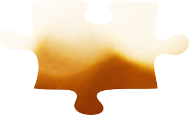

# Credits

Thanks to [Steven](https://twitter.com/StevenVanAcker) for making this challenge!

This challenge was for the first day (December 7th) of the Advent CTF.

# Table of contents
1. [Starting off](#starting-off)
2. [Exif data](#exif-data)
3. [Timestamps and base64](#timestamps-and-base64)

## Starting off

We're presented with a [compressed file](ea1feb55191a6b220ffa521b568fb5b42ee4115b8c086b038d729b46dd5f5dfb_jigsaw_pieces.tar.xz).

We can easily un-tar it and see that it contains a bunch of pictures of jigsaw pieces, like so:



There are quite a few pieces (a total of 667) and many have difference shapes and symbols on them that appear to spell out something (perhaps the flag).

## Exif data

There's a chance that solving the puzzle is possible by arranging the pieces into a final shape.
If that's the case, there's little chance that I'll be able to do that in a reasonable amount of time.
I also don't have an OpenCV (or similar) programming experience, so let's hope there's another outlet.

Since these are images, let's check out if they have an Exif data.

```bash
# exiftool jigsaw_pieces/00168226de721bf30d62a60a2a34b4074a8c5d70d5ccd7cbfcc35b2a0a071e75.png
ExifTool Version Number         : 12.30
File Name                       : 00168226de721bf30d62a60a2a34b4074a8c5d70d5ccd7cbfcc35b2a0a071e75.png
Directory                       : jigsaw_pieces
File Size                       : 31 KiB
File Modification Date/Time     : 2021:11:19 11:52:31-08:00
File Access Date/Time           : 2021:12:19 13:17:16-08:00
File Inode Change Date/Time     : 2021:12:19 13:17:16-08:00
File Permissions                : -rw-r--r--
File Type                       : PNG
File Type Extension             : png
MIME Type                       : image/png
Image Width                     : 318
Image Height                    : 195
Bit Depth                       : 8
Color Type                      : RGB with Alpha
Compression                     : Deflate/Inflate
Filter                          : Adaptive
Interlace                       : Noninterlaced
Gamma                           : 2.2
White Point X                   : 0.3127
White Point Y                   : 0.329
Red X                           : 0.64
Red Y                           : 0.33
Green X                         : 0.3
Green Y                         : 0.6
Blue X                          : 0.15
Blue Y                          : 0.06
Background Color                : 255 255 255
Comment                         : Secret data: 'gXF'
Image Size                      : 318x195
Megapixels                      : 0.062
```

Bingo. We notice some "Secret data" right away.

Looking at our other images, we can see that these values are different, but _do_ repeat relatively frequently.

```bash
# exiftool jigsaw_pieces/*.png | grep 'Secret data:' | cut -d':' -f3 | sort | uniq -c | sort -rn | head
  50  'gI'
  50  'Ag'
  46  'CA'
  45  'IC'
  35  'ICA'
  31  'gIC'
  24  'CAg'
  18  'AgI'
   7  'Ki'
   6  'uL'
```

## Timestamps and base64

Going further, if we pull out all this data and check the various values, we find [0-9A-Za-z].
This leads up to believe there is potentially something happening here related to base62 or base64.

We hit a dead end for a bit and no ordering that we can think of (based on filename, size, etc.) leads up to a solution.

Eventually though, we try ordering by "File Modification Date/Time" (which can also be done with a `ls -t`) and see a result.

We run this through base64 decoding and find ourselves in luck.

```bash
# ls -rt jigsaw_pieces/* | xargs exiftool -s -s -s - | grep 'Secret data' | sed "s_.*: '\(.*\)'_\1_g" | tr -d '\n' | base64 -D
 .       .        _+_        .                  .             .
                  /|\
       .           *     .       .            .                   .
.                i/|\i                                   .               .
      .    .     // \\*              Santa wishes everyone all
                */( )\\      .           the best for 2022       .
        .      i/*/ \ \i             ***************************
 .             / /* *\+\             Hopefully you can use this:   .
      .       */// + \*\\*       AOTW{Sm4ll_p1ec3s_mak3_4_b1g_pic7ure}       .
             i/  /^  ^\  \i    .               ... . ...
.        .   / /+/ ()^ *\ \                 ........ .
            i//*/_^- -  \*\i              ...  ..  ..               .
    .       / // * ^ \ * \ \             ..
          i/ /*  ^  * ^ + \ \i          ..     ___            _________
          / / // / | \ \  \ *\         >U___^_[[_]|  ______  |_|_|_|_|_|
   ____(|)____    |||                  [__________|=|______|=|_|_|_|_|_|=
  |_____|_____|   |||                   oo OOOO oo   oo  oo   o-o   o-o
 -|     |     |-.-|||.-.-.-.-.-.-.-.-.-.-.-.-.-.-.-.-.-.-.-.-.-.-.-.-.-.-
  |_____|_____|
```

We're let with out flag: `AOTW{Sm4ll_p1ec3s_mak3_4_b1g_pic7ure}`
